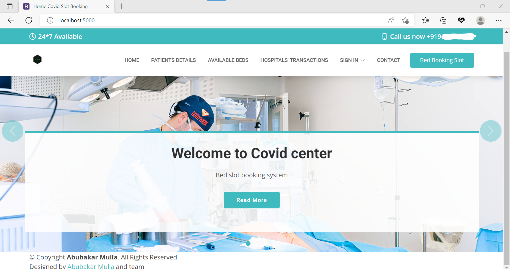
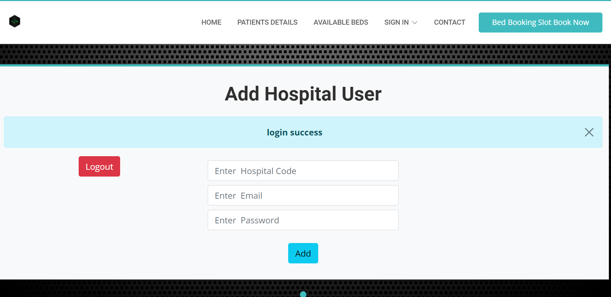
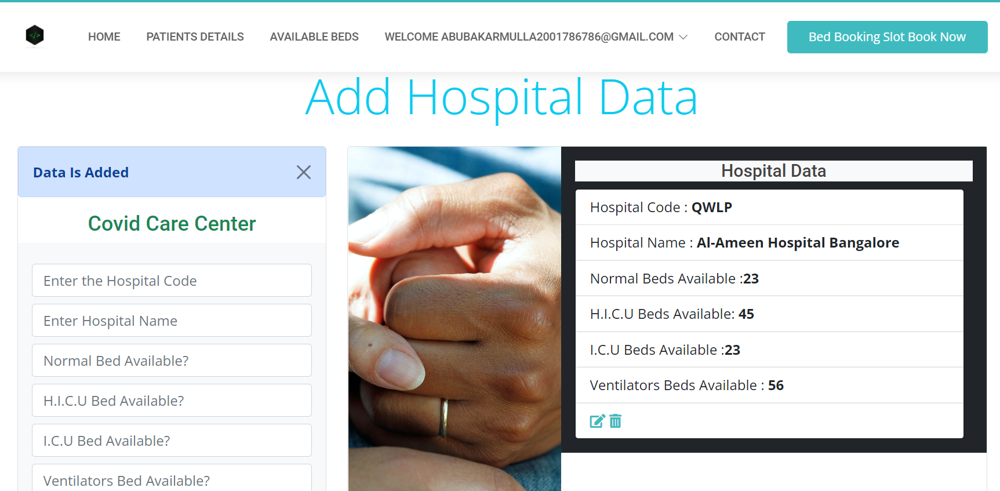
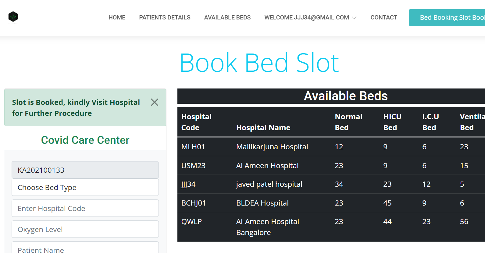

# Hospital Bed-Booking Portal for covid19 patients
## About:
It is a Web application (DBMS mini-project) using which users can book beds of hospitals during the pandemic situation to avoid the spread of covid19 and to get treatment on time.
## Tech used:
> HTML, CSS, JS, Python (Flask) and MySQL
## Snapshots:
> Home page

_ _ _
> Admin page

_ _ _
> Hospital User Adding Hospital Data

_ _ _
> Patient Booking Beds

_ _ _
